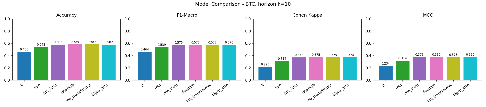
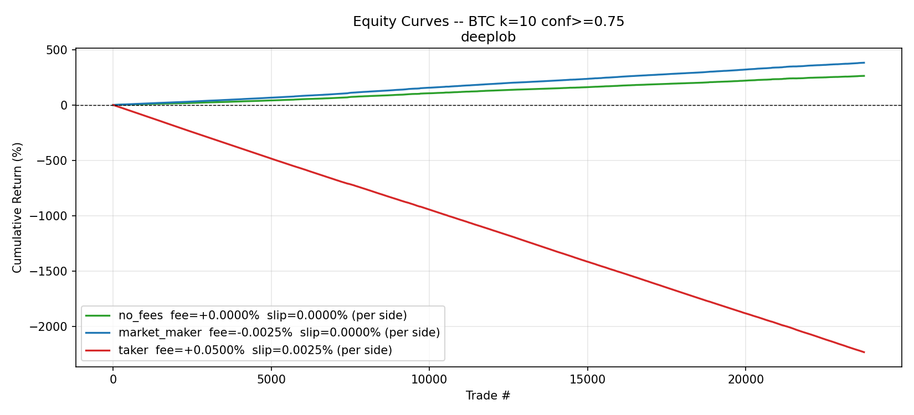
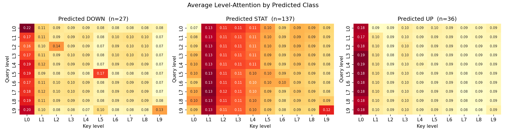
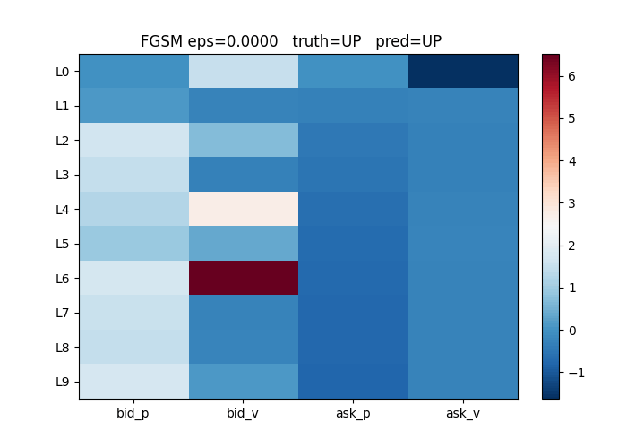

# Deep Learning for Limit Order Book Forecasting

Short-horizon mid-price direction prediction on cryptocurrency limit order book (LOB) data. The project benchmarks six architectures, from a logistic-regression baseline up to a custom attention transformer, on roughly 1.58M Binance Spot BTC order book snapshots, then stress-tests the result two ways: with adversarial perturbations and with a realistic multi-fee backtest that asks the only question that matters, namely whether a statistical edge survives trading costs.

The headline finding is deliberately unglamorous: the models do learn a real but small directional edge, and under retail trading fees that edge is wiped out by costs. That conclusion, not a Sharpe number, is the point of the project.

## Results

Test-set performance, BTC, prediction horizon k = 10 (held-out chronological split):

| Model | Accuracy | Cohen's Kappa | Macro F1 |
|---|---|---|---|
| Logistic Regression (baseline) | 0.465 | 0.220 | 0.464 |
| MLP | 0.542 | 0.314 | 0.539 |
| CNN-LSTM | 0.582 | 0.372 | 0.575 |
| DeepLOB (Zhang et al. 2019 reproduction) | 0.585 | 0.375 | 0.577 |
| LOBTransformer (this project) | 0.587 | 0.375 | 0.577 |
| BiGRU + Attention | 0.582 | 0.374 | 0.576 |

The deep models cluster tightly around 0.37 Kappa and roughly 58% three-class accuracy, well above the 0.22 Kappa linear baseline but with no single architecture pulling decisively ahead. The custom transformer matches the published DeepLOB benchmark rather than beating it, which is reported as-is. Results for horizons k = 20 and k = 50 are in `results/`.

## Key figures

Model comparison across architectures:



Multi-fee backtest equity, showing the edge surviving only under maker-tier execution:



Per-class attention over the order book, used to check the model attends to economically sensible levels rather than noise:



FGSM adversarial perturbation of the input book:



## What the project does

**Data and labels.** Raw Binance Spot LOB ticks are streamed from nested JSON into daily Parquet shards, using the top 10 of 50 available price levels per side. Each snapshot is labeled for three-class direction (down, flat, up) at three forecast horizons, k in {10, 20, 50}, with quantile-based thresholds so the classes are balanced rather than dominated by "flat."

**Splits.** Train, validation, and test are chronological and walk-forward, so no future information leaks backward, and training uses class-weighted cross-entropy to handle residual imbalance.

**Models.** Six architectures share one training and evaluation harness: Logistic Regression, MLP, CNN-LSTM, a DeepLOB reproduction, a custom hierarchical 2D attention transformer with a multi-task volatility head (LOBTransformer), and a BiGRU with attention.

**Evaluation.** Beyond accuracy and F1, the project reports Cohen's Kappa and Matthews correlation coefficient, runs an FGSM adversarial-robustness check on each model, and visualizes attention weights to test interpretability.

**Backtest.** A from-scratch backtest converts predictions into a traded strategy under three fee regimes (zero-friction, VIP maker rebate, retail taker), with confidence-threshold gating, a daily trade-frequency cap, short-borrow modeling, and a daily profit-and-loss rollup to a period Sharpe. The comparison across regimes is the project's central result: retail round-trip cost exceeds the gross per-trade edge by roughly an order of magnitude, while only maker-tier execution preserves a positive period Sharpe over the test window.

## Repository structure

The code lives in `Implementation.ipynb`, organized top to bottom into the modules below. A second notebook, `results.ipynb`, is the executed run and ships with its outputs intact, so its plots and metrics render on GitHub without anyone running the code.

```
.
├── Implementation.ipynb     # full annotated implementation (all sections below)
├── results.ipynb            # executed run with rendered plots and metrics
├── config.py                # paths, hyperparameters, symbols, horizons
├── data/
│   ├── preprocess.py         # streaming JSON -> daily Parquet (ijson)
│   └── dataset.py            # PyTorch Dataset, feature normalization, walk-forward split
├── models/
│   ├── baseline.py           # Logistic Regression, MLP
│   ├── cnn_lstm.py
│   ├── deeplob.py            # Zhang et al. 2019 reproduction
│   ├── lob_transformer.py    # custom 2D attention transformer + volatility head
│   └── bigru_attention.py
├── train.py                  # training loop, walk-forward CV
├── evaluate.py               # metrics, adversarial robustness, attention export
├── backtest.py               # multi-fee backtest with execution constraints
├── run.py                    # CLI driver (preprocess / train / evaluate / backtest)
├── utils.py                  # class weights, metrics, result IO
├── results/                  # per-model, per-horizon metric JSONs (committed)
├── report.pdf                # full write-up
├── slides.pdf                # presentation deck
└── figures/                  # committed plots and animations
```

If you prefer modules over a single notebook, split each section of `Implementation.ipynb` into the file named in its header.

## Data

The raw data is Binance Spot order book snapshots (CryptoLOB-2025), roughly 1.58M usable BTC snapshots after preprocessing. The raw JSON is about 10GB and the processed Parquet shards and trained checkpoints are large, so none of them are committed (see `.gitignore`). Only code, metrics, figures, and the report are tracked.

To reproduce, set the data location in `config.py` (or via an environment variable) to point at your local raw data directory, then run the pipeline below. A small sample of snapshots is enough to exercise the full code path end to end before committing to a full run.

## How to run

```bash
# 1. Environment
python -m venv .venv && source .venv/bin/activate
pip install -r requirements.txt

# 2. Point config.py at your raw data directory, then preprocess (once per symbol)
python run.py preprocess --symbol BTC
python run.py preprocess --symbol BTC --debug      # fast path: one day only

# 3. Train a model at a horizon
python run.py train --model lob_transformer --symbol BTC --horizon 10
python run.py train --model deeplob         --symbol BTC --horizon 10

# 4. Evaluate (metrics, adversarial, attention)
python run.py evaluate --model lob_transformer --symbol BTC --horizon 10

# 5. Backtest across fee regimes
python run.py backtest --model lob_transformer --symbol BTC --horizon 10
```

Preprocessing a full symbol takes roughly one to two hours; the `--debug` flag runs on a single day for a quick sanity check.

## Honest evaluation notes

The notebook includes a QA section that re-runs the reported metrics from scratch and documents what is and is not claimed. In particular the project deliberately does not report headline Sharpe figures without the accompanying cost assumptions, because the whole point is that the costless and retail-cost results tell opposite stories. The intent throughout is to show where the edge is real, where it disappears, and why.

## Tech stack

Python, PyTorch, NumPy, pandas, scikit-learn, ijson and PyArrow for streaming preprocessing, Matplotlib for figures.
